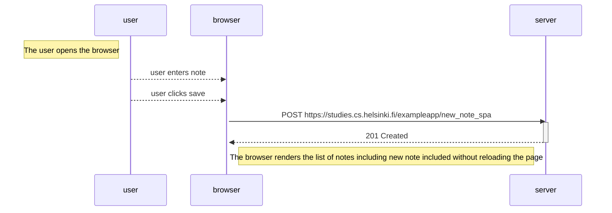

New note diagram single page app

```mermaid
sequenceDiagram
    participant user
    participant browser
    participant server

    Note left of user: The user opens the browser
    user-->>browser: user enters note
    user-->>browser: user clicks save
    activate browser
    browser->>server: POST https://studies.cs.helsinki.fi/exampleapp/new_note_spa
    activate server
    server-->>browser: 201 Created
    deactivate server

    Note right of browser: The browser renders the list of notes including new note included without reloading the page
```
